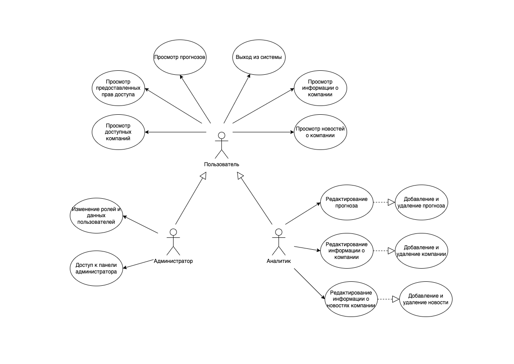
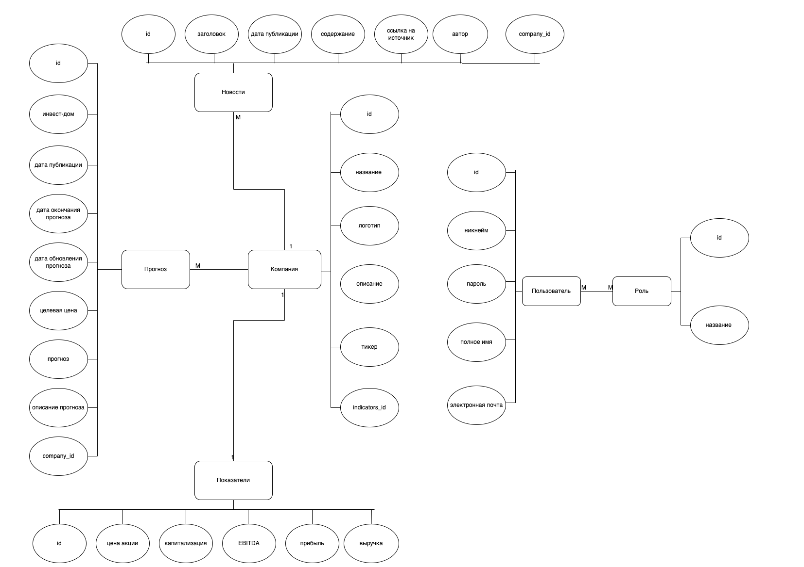
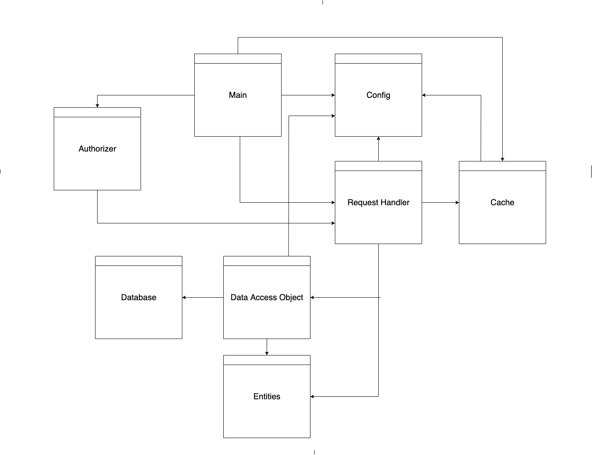
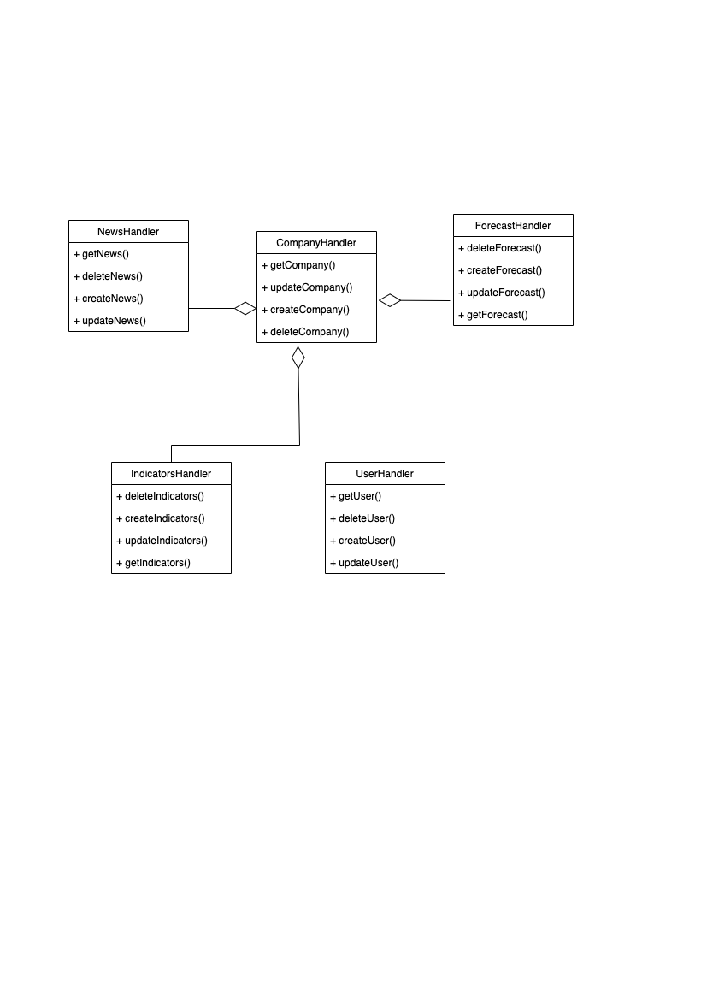
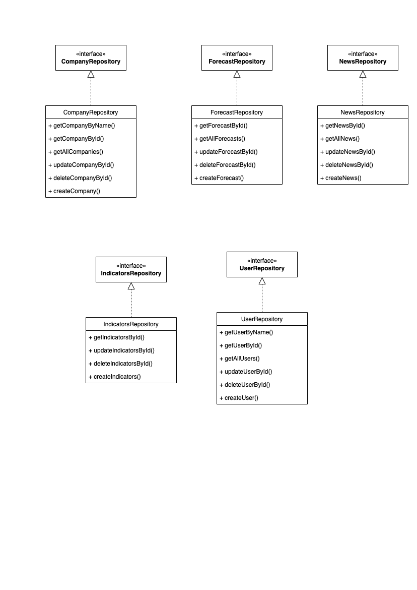
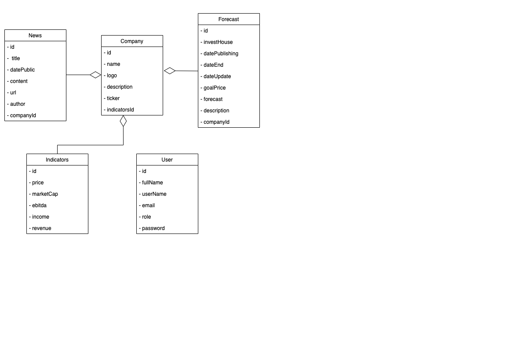
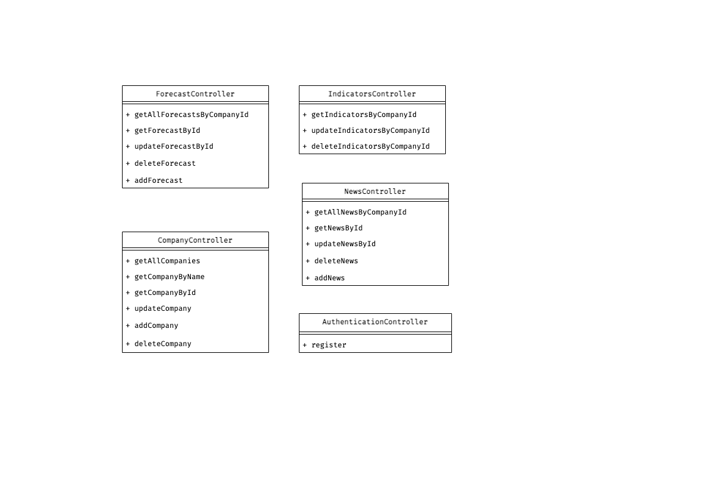
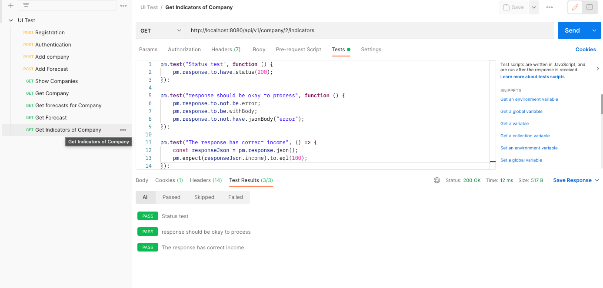
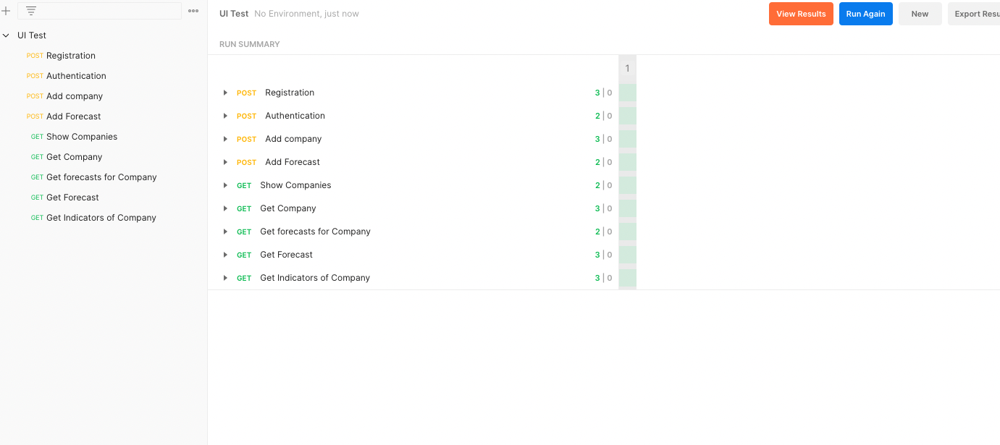
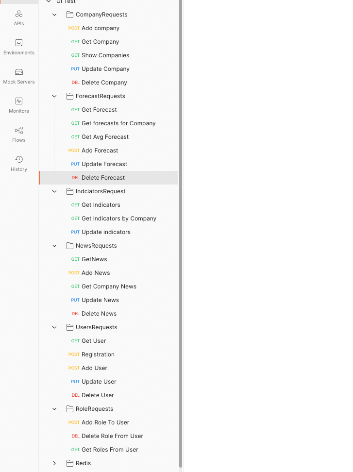

## 1. Веб-приложение агргатор прогнозов на курс акции.
---
## 2. Приложение позволяет ознакомиться с компаниями на фондовом рынке, а также с прогнозами стоимости акций от различных аналитиков инвестдомов. 
---
## 3. Предметная область: 

- Сущность __Company__ содержит информацию о характеристиках компании (название, тикер, описание, логотип).
- Сущность __Forecast__ содержит информацию о прогнозах от различных аналитиков (прогнозируемую цену акции, срок, описание прогноза, название инвестдома).
- Сущность __Indicators__ содержит информацию о финансовых показателях компании.
- Сущность __User__ содержит информацию о пользователе (роль, имя, никнейм, почта, захешированный пароль)
---
## 4. 

| Инвестдом | Аргументация прогнозов | Обширное количество источников | Наличие графиков |
|----------------|:---------:|:---------:|----------------:|
| __Tinkoff__ | - | + | - |
| __RBC__ | - | - | - |
| __Investing__ | - | + | + |

---
## 5. ___«Самые большие деньги на фондовом рынке делаются в периоды спада. Просто в такие моменты люди этого не понимают».___ (Shelby Davis). Кризис - отличное время для инвестирования, поэтому в наше время множество людей захочет купить «просевшие» акции, а следовательно возникнет спрос на прогнозы.
---
## 6. Use-Case

---
## 7. ER

---
## 8. Монолитная архитектура

Тип приложения - Web MPA.

Стек: 

<ul>
    <li>Фронтенд 
        <ul>
            <li>HTML</li>
            <li>CSS</li>
            <li>Bootstrap</li>
            <li>ReactJS</li>
        </ul>
    </li>
    <li>Бэкенд
        <ul>
            <li>Java Spring</li>
            <li>Docker</li>
            <li>PostgreSQL</li>
        </ul>
    </li>
</ul>

# 2.  Верхнеуровневое разбиение на компоненты

# 3.  UML диаграммы классов для двух отдельных компонентов - компонента доступа к данным и компонента с бизнес-логикой

# 4. UML диаграммы «модельных» классов сущностей
## Сущности базы данных (сущности системы и модельные) 

# 5. UML-диаграммы классов для модуля, связывающего GUI и   бизнес-логику

# 6. Программная реализация технологического UI 
## Файл с реализацией тестов находится в папке /ui/tests

